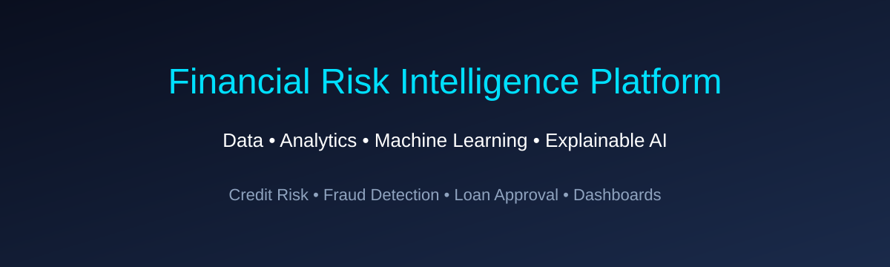

# Financial Risk Intelligence Platform (FRIP)



> An end-to-end credit-risk analytics project that combines secure data ingestion, feature engineering, machine learning, and explainable AI to support more consistent credit decisions.

## Table of contents

- [Business problem](#business-problem)
- [Project highlights](#project-highlights)
- [Results](#results)
- [Data](#data)
- [Solution architecture](#solution-architecture)
- [Repository structure](#repository-structure)
- [Notebooks](#notebooks)
- [Getting started](#getting-started)
- [Project status](#project-status)
- [Roadmap](#roadmap)
- [Responsible use](#responsible-use)
- [Author](#author)
- [License](#license)

## Business problem

Credit institutions need to grow their portfolios without accepting an unsustainable level of default risk. Approving high-risk applicants can increase expected losses; rejecting low-risk applicants can reduce revenue and customer access to credit.

FRIP estimates the probability of customer default from historical application, financial, and behavioural information. The model is designed to support—not replace—credit analysts by providing consistent risk signals and transparent explanations for individual predictions.

## Project highlights

- Secure, reproducible ingestion of the source data through the Kaggle API and local environment variables.
- Data-quality audit with file discovery, schema checks, and missingness profiling.
- Feature engineering from customer, employment, financial, household, credit-history, and document-flag variables.
- Comparison of baseline and tree-based classification models.
- Global and local model explanations with SHAP.
- Executive report that translates model outputs into business context.

## Results

The modeling notebook evaluates candidate models with ROC-AUC. In the current experiment, **HistGradientBoosting** produced the strongest result.

| Model | ROC-AUC |
| --- | ---: |
| Logistic Regression | 0.7427 |
| Random Forest | 0.7423 |
| Gradient Boosting | 0.7585 |
| **HistGradientBoosting** | **0.7625** |

These results are exploratory and should be revalidated before any production use. AUC measures ranking quality; a real credit policy must also define a decision threshold using costs, portfolio objectives, fairness, and regulatory constraints.

## Data

The project uses the [Home Credit Default Risk](https://www.kaggle.com/competitions/home-credit-default-risk) competition data. The target variable, `TARGET`, indicates whether an applicant experienced payment difficulties.

The acquisition notebook downloads the files through the Kaggle API. Raw data and credentials must remain local; they should never be committed to a public repository.

## Solution architecture

```text
Kaggle API
    |
    v
Raw data + quality audit
    |
    v
Cleaning, EDA, and feature engineering
    |
    v
Model comparison and ROC-AUC evaluation
    |
    v
SHAP explanations + executive insights
```

## Repository structure

```text
frip/
├── data/
│   ├── Raw/                    # Downloaded source files (local only)
│   └── Processed/              # Validated and feature-engineered datasets
├── docs/                       # Business notes and documentation
├── images/                     # README assets and analysis visuals
├── models/                      # Saved model pipeline and experiment metadata (local)
├── notebooks/                  # End-to-end analysis notebooks
│   ├── 01_data_acquisition.ipynb
│   ├── 02_exploratory.ipynb
│   ├── 03_feature_engineering.ipynb
│   ├── 04_modeling.ipynb
│   ├── 05_explainability.ipynb
│   └── 06_executive_report.ipynb
├── reports/                    # Exported business and model outputs
├── src/                        # Reusable Python modules (future expansion)
├── tests/                      # Automated tests (future expansion)
├── .env                        # Local Kaggle credentials (never commit)
├── requirements.txt
└── readme.md
```

## Notebooks

| Notebook | Purpose |
| --- | --- |
| `01_data_acquisition.ipynb` | Authenticates with Kaggle, downloads the competition files, and runs an initial quality audit. |
| `02_exploratory.ipynb` | Explores distributions, correlations, and financial-risk patterns. |
| `03_feature_engineering.ipynb` | Creates modelling features from financial, employment, household, social-circle, and document information. |
| `04_modeling.ipynb` | Trains and compares Logistic Regression, Random Forest, Gradient Boosting, and HistGradientBoosting. |
| `05_explainability.ipynb` | Uses SHAP to inspect global feature importance and individual predictions. |
| `06_executive_report.ipynb` | Consolidates the analysis into business context, portfolio insights, and recommendations. |

## Getting started

### Prerequisites

- Python 3.10 or newer
- A Kaggle account with access to the competition data
- Kaggle API credentials (`KAGGLE_USERNAME` and `KAGGLE_KEY`)

### Installation

```bash
git clone <your-repository-url>
cd frip
python -m venv .venv
```

Activate the virtual environment:

```bash
# Windows PowerShell
.venv\Scripts\Activate.ps1

# macOS / Linux
source .venv/bin/activate
```

Install the project dependencies:

```bash
pip install -r requirements.txt
```

### Configure Kaggle access

Create a local `.env` file in the repository root:

```env
KAGGLE_USERNAME=your_kaggle_username
KAGGLE_KEY=your_kaggle_api_key
```

Keep this file private. It is intentionally excluded from version control.

### Run the project

Start Jupyter from the repository root:

```bash
jupyter notebook
```

Execute the notebooks in numerical order. Notebook 01 downloads and audits the data; subsequent notebooks use the processed outputs.

The modelling notebook saves the selected pipeline and its metadata to `models/`. The explainability and executive-report notebooks load those same artifacts, ensuring that interpretation and business reporting refer to the evaluated experiment.

## Project status

- [x] Secure data acquisition and baseline quality audit
- [x] Exploratory data analysis
- [x] Feature engineering
- [x] Model training and comparison
- [x] Explainable AI with SHAP
- [x] Executive report notebook
- [ ] Interactive dashboard
- [ ] API for model scoring
- [ ] Containerization and deployment
- [ ] Automated tests and model monitoring

## Roadmap

- Define risk buckets and business KPIs such as approval rate, default capture rate, and expected loss.
- Calibrate the selected model and choose thresholds based on business costs.
- Build a Streamlit dashboard for portfolio and applicant-level exploration.
- Expose a scoring endpoint with FastAPI.
- Add Docker, automated tests, and data/model monitoring.

## Responsible use

This is an educational portfolio project using competition data. It is not a production credit-decisioning system. Before a real deployment, the solution would require data governance, privacy controls, bias and fairness testing, performance monitoring, validation, documentation, and human oversight.

## Author

**Paulo Henrique Tamboril**  
Data Analytics | Financial Analytics | Machine Learning

## License

This project is distributed under the [MIT License](License).
